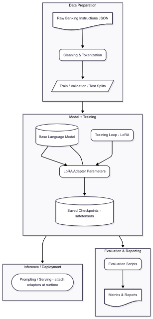

# Parameter-Efficient Fine-Tuning

This repository contains code and data for the assignment on Parameter-Efficient Fine-Tuning.

Contents
- `Banking-Data/` — dataset, scripts, outputs, and training checkpoints.

Quick start
1. Create a Python environment and install requirements:

```bash
python -m venv .venv
source .venv/bin/activate
pip install -r Banking-Data/requirements.txt
```

2. Inspect data and run training (example):

```bash
# run a training script (adjust args as needed)
python Banking-Data/scripts/train_lora.py
```

Notes
- This repo includes pre-prepared LoRA checkpoints under `Banking-Data/output/checkpoints/`.
- Update `Banking-Data/README.md` or the assignment scripts for dataset-specific instructions.

## Architecture & Purpose

### Purpose
- Demonstrate parameter-efficient fine-tuning for instruction-following banking data using LoRA adapters.
- Keep compute and storage costs low by training small adapter weights instead of full model weights.
- Provide reproducible scripts, checkpoints, and evaluation for interview discussion and demos.

### Architecture (high-level)
This project follows a straightforward data-to-deployment pipeline:

- Data ingestion and cleaning -> dataset splits -> training with LoRA adapters on a base LM -> checkpointing -> evaluation and reporting.

See `docs/architecture.mmd` for a simple diagram you can show in interviews.

### Interview talking points
- Explain why LoRA reduces trainable parameters and speeds up iteration.
- Describe dataset preparation choices and evaluation metrics used in `Banking-Data/scripts`.
- Point to `Banking-Data/output/checkpoints` to show real adapter checkpoints and explain how they attach to the base model at inference.

### Architecture mapping (diagram -> repo)
- **Raw Banking Instructions JSON**: source data files: `Banking-Data/banking_instruction_dataset_480.json` and the batch files under `Banking-Data/sets/`.
- **Cleaning & Tokenization**: implemented by `Banking-Data/task1_pipeline.py` and helper `Banking-Data/merge_json.py` which normalize and prepare examples.
- **Train / Validation / Test Splits**: output split files in `Banking-Data/output/` (`train.json`, `validation.json`, `test.json`).
- **Base Language Model**: the pretrained model used at training time (configured/loaded in `Banking-Data/scripts/train_lora.py`).
- **LoRA Adapter Parameters**: adapter weights produced and stored under `Banking-Data/output/checkpoints/lora_v1/` (files like `adapter_model.safetensors`, `adapter_config.json`).
- **Training Loop - LoRA**: training logic and hyperparameters are in `Banking-Data/scripts/train_lora.py` and `Banking-Data/run_all.sh` (example orchestration).
- **Saved Checkpoints - safetensors**: look in `Banking-Data/output/checkpoints/lora_v1/` and its `checkpoint-50/` subfolder for artifacts.
- **Evaluation Scripts**: evaluation and benchmark scripts: `Banking-Data/scripts/evaluate_models.py` and `Banking-Data/scripts/benchmark_and_evaluate.py`.
- **Metrics & Reports**: evaluation outputs in `Banking-Data/output/` such as `evaluation_summary.json`, `assignment_report_summary.json`, and `cleaning_report.csv`.
- **Prompting / Serving - attach adapters at runtime**: examples and inference orchestration appear in `Banking-Data/scripts/run_assignment.py` and `Banking-Data/scripts/finalize_assignment.py` (load base model and adapter for serving).

Use this mapping in interviews to point directly to code and artifacts when describing each pipeline stage.

### Pipeline diagram image
An illustrated pipeline image is included for quick reference during interviews:



The image file is `docs/lora_finetune_pipeline.png` — open it to show a visual flow of the data cleaning, training (LoRA adapters), checkpointing, and evaluation steps.


